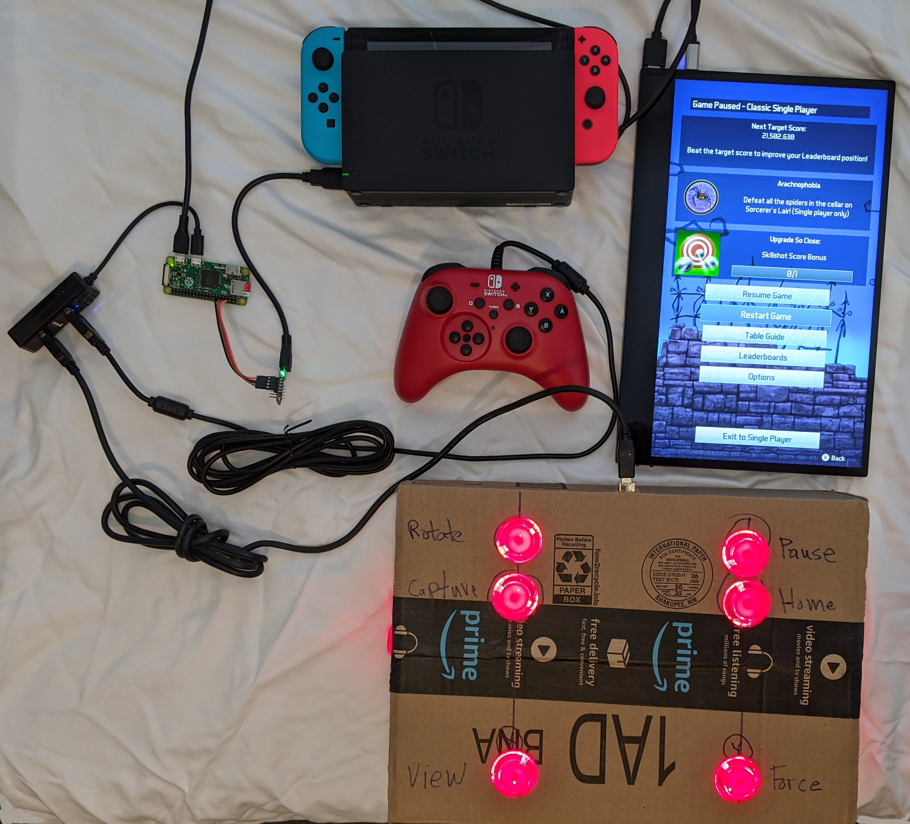
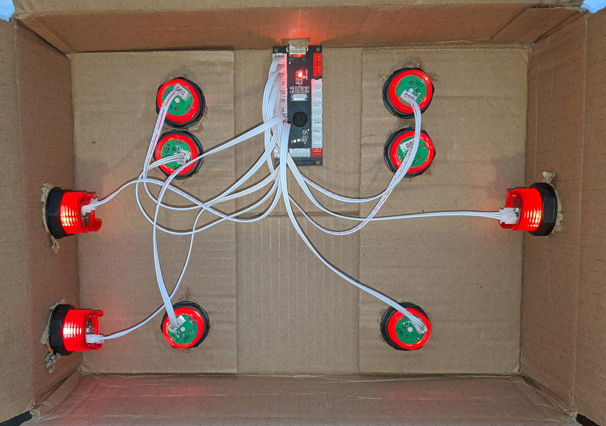

# Custom Pinball Controller for Nintendo Switch



As a test of NSGadget, I built a custom pinball controller. A pinball
controller is very easy. Two buttons to control the flippers and one to launch
the ball are all that are necessary. Mounting the flipper buttons on the side
of box makes the controller feel like a real pinball machine. More buttons
are not needed but make the controller easier to use.

This is a test of the response time of using USB joystick buttons passing
through the Pi, through the NSGadget, then to the NS. After playing a few hours
of Pinball FX3 (free download!), there is no lag problem. I also played using a
USB NS controller plugged into the NS for comparison. No difference although I
am not a pinball expert.

The buttons and USB encoder board are from a kit. No soldering or crimping is
required. Just connect the buttons to the encoder board using the included
cables. USB cables are also included. Search EBay or Amazon for "arcade buttons
sticks kit" for many different options. I am using a kit from Amazon with 20
buttons, 2 sticks, and 2 USB encoder boards for about $40. The manufacturer
of the USB encoder board is Dragon Rise.

## Hardware

* NS compatible gamepad
* Custom pinball controller (more below)
* USB OTG 4 port hub
* Pi Zero with headers running Raspbian Buster
* NSGadget is an Adafruit Trinket M0 running NSGadget firmware.
* Nintendo Switch in dock
* Portable HDMI monitor. Any HDMI monitor/TV should work.

NSGadget impersonates a USB gamepad so no modifications to the NS are required.
The NS is not modified or hacked or rooted.

### Pinball controller



The prototype pinball controller is a cardboard box containing the USB joystick
encoder board and nine arcade buttons.

## Software

nsswpinball.py is similar to nsac.py but the read_dragon_rise function has
been modified for the pinball controller. See the code below.

Two functions are not possible using the pinball controller. Since the gamepad
is also active, it can be used instead.

The right thumbstick controls the ball launch speed. Pulling the stick back
half way then releasing it, launches the ball at a slower speed than pulling
the stick back all the way.

The left thumbstick controls the table bump or nudge.

```
def read_dragon_rise(jsdev):
    """
    Star Wars/FX3 Pinball controls
    """
    BUTTON_MAP = array.array('B', [
        NSButton.LEFT_THROTTLE,     # Left flipper
        NSButton.MINUS,             # Rotate screen
        NSButton.CAPTURE,           # Screen capture
        NSButton.RIGHT_THROTTLE,    # Right flipper
        NSButton.PLUS,              # Pause
        NSButton.HOME,              # Home
        NSButton.A,                 # Auto ball launch
        NSButton.B,                 # not used
        NSButton.X,                 # Change view
        NSButton.Y,                 # Force
        NSButton.LEFT_TRIGGER,      # not used
        NSButton.RIGHT_TRIGGER      # not used
    ])


    while True:
        try:
            evbuf = jsdev.read(8)
        except:
            jsdev.close()
            break
        if evbuf:
            timestamp, value, type, number = unpack('IhBB', evbuf)
            if type == 0x01: # button event
                button_out = BUTTON_MAP[number]
                if value:
                    NSG.press(button_out)
                else:
                    NSG.release(button_out)

```
